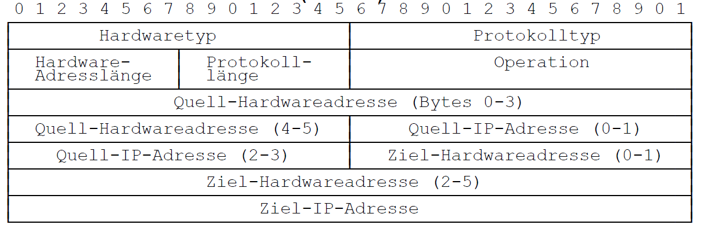

# IP Hilfsprotokolle

## ARP

- Zuordnung MAC-Adresse zur IP-Adresse
  - ohne MAC Adresse keine Übertragung möglich
- Header:

## DHCP

- Dynamic Host Configuration Protocol
- Vergabe von IP-Adresse an anfragenden Rechner

