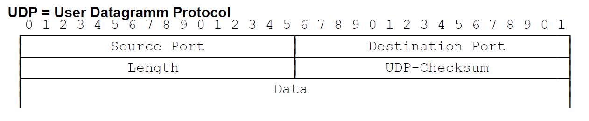

# Transportebene

## Ziele und Aufgaben

- Adressierung über Ports
  - mehrere Anwendungen können gleichzeitig Netzwerkkarte benutzen
  - $2^{16} - 1 = 65535$ Ports
- Flussteuerung 
- Fehlerkorrektur
- Überlaststeuerung (implizit)
- Verbindungssteuerung
- Kommunikationsports
- Segmentverkettung

## Protokolle

### UDP

- User Datagram Protocol
- verbindungslos
- keine Flusssteuerung
- keine Empfangsbestätitung
- Header (8 Byte)
  

### TCP

- Transport Control Protocol
- verbindungsorientiert (3 Way Handshake)
- Flusssteuerung (über Sliding Window)
- Überlaststeurung (über Slow Start und Congestion Window)
- Empfangsbestätigung und Sendewiederholung bei fehlerhaftem Paket (Fast Retransmit)

#### Verbindungsaufbau und Verbindungsabbau

#### Sliding Window

- senden mehrer Pakete ohne Bestätigung des vorherigen
  - Pakete müssen im Sliding Window enthalten sein
- Größe des Sliding Windows wird ausgehandelt und orientiert sich an den Größen der Buffer bei Sender und Empfänger
#### Slow Start