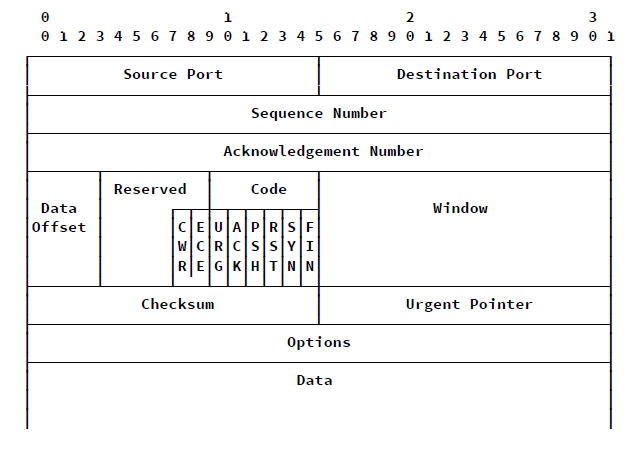

# Transportebene

## Ziele und Aufgaben

- Adressierung über Ports
  - mehrere Anwendungen können gleichzeitig Netzwerkkarte benutzen
  - $2^{16} - 1 = 65535$ Ports
- Flussteuerung 
- Fehlerkorrektur
- Überlaststeuerung (implizit)
- Verbindungssteuerung
- Kommunikationsports
- Segmentverkettung

## Protokolle

### UDP

- User Datagram Protocol
- verbindungslos
- keine Flusssteuerung
- keine Empfangsbestätitung
- Header (8 Byte)
  

### TCP

- Transport Control Protocol
- verbindungsorientiert (3 Way Handshake)
- Flusssteuerung (über Sliding Window)
- Überlaststeurung (über Slow Start und Congestion Window)
- Empfangsbestätigung und Sendewiederholung bei fehlerhaftem Paket (Fast Retransmit)
- Headerlänge:
  - minimal: 20 Byte (keine Options enthalten)
  - maximal: 40 Byte (Options enthalten)
- Header
  

#### Flags

- CWR: Sender informiert über Überlast
- ECE: Empfänger informiert über Überlast
- URG: Dringlich -> Übergabe an Anwendung, Unterbrechnung des Segments
- ACK: Acknowledgement
- PSH: sofortige Abarbeitung des Pakets
- RST: Verbindungsabbruch
- SYN: Verbindungsaufbau
- FIN: Verbindungsabbau

#### Zustände

- LISTEN
  - idle-Zustand
  - keine Verbindung aufgebaut
- SYN-SENT
  - 3 Way Handshake initiert
  - warte auf ACK
- SYN-RECEIVED
  - Anfrage zum Verbindungsaufbau erhalten
- ESTABLISHED
  - Verbindung wurde aufgebaut
  - Daten können gesendet werden
- FIN-WAIT-1
  - FIN gesendet
  - Warte auf Verbindungsabbau vom Gegenüber
- FIN-WAIT-2
  - Bestätigung der Verbindungsabbaus erhalten
- CLOSE-WAIT
  - Verbindungsabbau durch obere Schicht
- CLOSING
  - FIN nach eigenem FIN erhalten
- LAST-ACK
  - warte auf letztes ACK beim Verbindungsabbau

#### Acknowledgement Strategien

- unmittelbare Bestätigung
  - Sende sofort leeres ACK Segment
- kumulative Bestätigung
  - Bestätige zwei Segmente über Piggybacking
  - "Reihe ist bis jetzt erfolgreich angekommen"
- verzögerte Bestätigung
  - warte mit Bestätigung eine Zeit
  - liegt dann keine Paket in in Gegenrichtung vor, sende ein leeres ACK
- sofortiges Duplikat ACK (dACK)
  - Paket trifft außerhalb der Reihenfolge ein
- sofortiges ACK nach Festellen einer Paket-Lücke (SACK)
  - Empfänger teilt explizit die nicht erhaltenen Pakete eines Streams mit

#### Verbindungsaufbau und Verbindungsabbau

##### Aufbau

- Client sendet Paket mit Sequenznummer
- Server bestätigt die indem die ACK-Nummer die Sequenznummer + 1 ist. Die Sequenznummer des Pakets ist eine weitere Zahl
- Der Client sendet dann ein Paket zurück dessen ACK-Nummer die Sequenznummer des erhaltenen Pakets um 1 erhöht ist

-> **Dreiwege Handshake**

##### Abbau

- Teilnehmer A sendet ein FIN Paket -> Teilnehmer A wird keine Daten mehr senden
- Teilnehmer B bestätigt das Paket von A
- Teilnehmer B kann weiter Daten senden
- Teilnehmer B sendet ein FIN Paket
- Teilnehmer A bestätigt das Paket von B und wartet 2*MSL (Maximum Segment Life) bevor auch A Verbindung schließt
- Teilnehmer B schließt Verbindung nach Erhalt des ACK

#### Sliding Window

- senden mehrer Pakete ohne Bestätigung des vorherigen
  - Pakete müssen im Sliding Window enthalten sein
- Größe des Sliding Windows wird ausgehandelt und orientiert sich an den Größen der Buffer bei Sender und Empfänger

#### Slow Start

- Vergrößerung des congestion windows (**cwnd**)
- Startwert liegt bei 1 oder dem Minimum von $$cwnd_{initial} = min(4*MSS,max(2*MSS,4380))$$ (MSS = **Maximum Segment Size**)
- Verdopplung dieses Werts bis zu einem Slow Start Threshhold $ss_{threshhold}$
- danach Congestion Avoidance -> linearer Anstieg mit festem Wert (z.B. +1)
- bei RT Timeout -> Empfänger gibt gar keine Antwort:
  - $ss_{threshhold,new} = \frac{cwnd}{2}$ und $cwnd = cwnd_{initial}$
- bei Double ACK (Pakete kommen an, aber eins ist verloren gegangen -> Fast Recovery)
  - $ss_{threshhold,new} = \frac{cwnd}{2}$ und $cwnd = \frac{cwnd}{2}$
  - Slow Start wird übersprungen

#### Timer

- Reconnection timer
  - minimale Wartezeit bevor nochmal Verbindung zum gleichen Ziel aufgebaut werden darf
- Window timer
  - Zeit die abgewartet werden muss, bevor die Window size nach einem ACK geändert werden kann
- Retransmit SYN Timer
  - Timer der SYNC-Anfragen begrenzt
- Give up timer
  - Timer der abläuft bevor eine Verbindung trotz eines ausstehenden ACK abgebaut wird 
- Quit Timer
  - Abbau der Verbindung, wenn in der Zeit keine Aktivität stattfand
- Persistence timer
  - falls Windows Size = 0, dann wird mit Ablauf des Timers ein Paket gesendet mit dem die Empfangsstation die Kommunikation wieder aufnehmen kann
